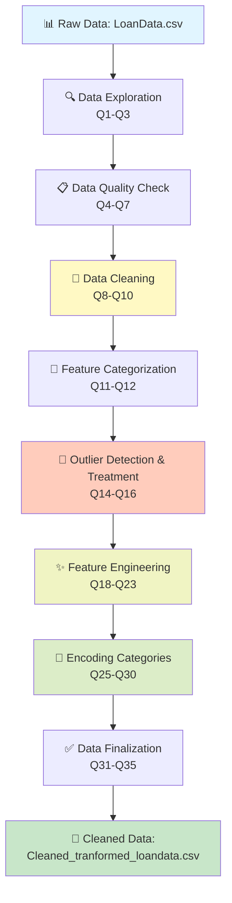
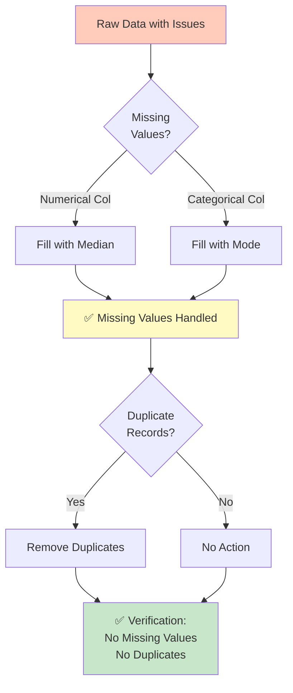
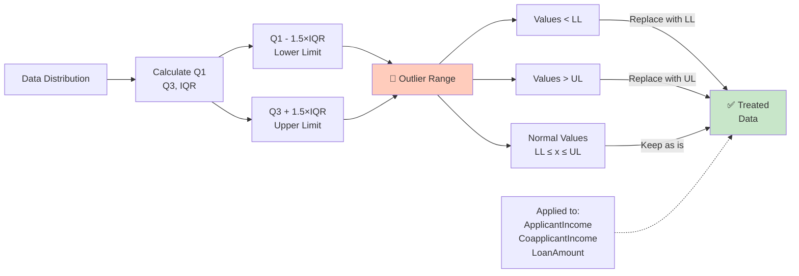
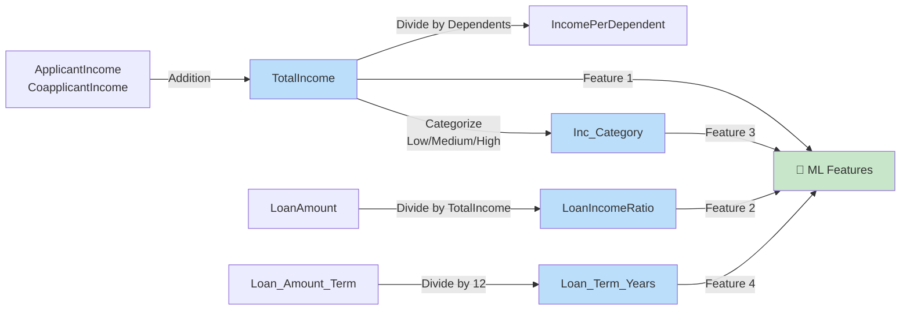
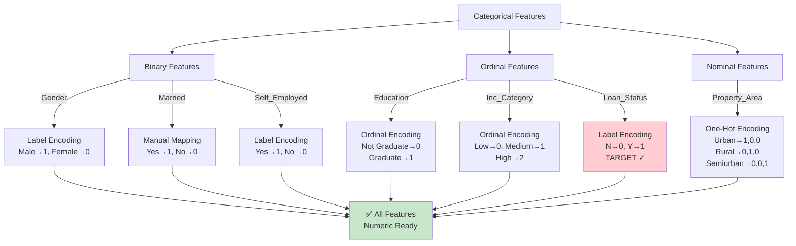
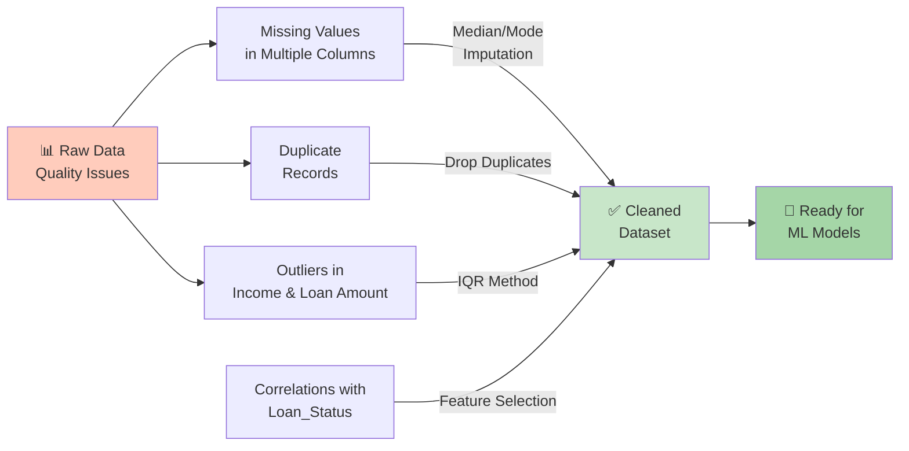
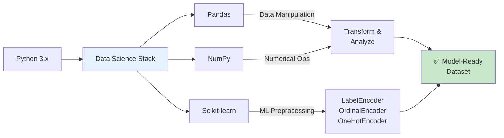
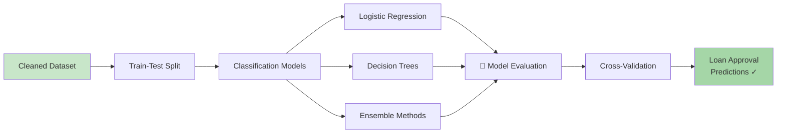

# Loan Data Preprocessing & Feature Engineering Project

## Overview

This project demonstrates a comprehensive data preprocessing and feature engineering pipeline for loan approval prediction. The workflow transforms raw loan data through multiple stages of cleaning, exploration, outlier treatment, and feature transformation, resulting in a clean, model-ready dataset.

## Dataset

**File:** `LoanData.csv`

### Original Features
- **Applicant Information:** Gender, Married, Dependents, Education, Self_Employed
- **Financial Information:** ApplicantIncome, CoapplicantIncome, LoanAmount, Loan_Amount_Term
- **Loan Details:** Loan_ID, Credit_History, Property_Area
- **Target Variable:** Loan_Status (binary classification: Y/N)

## Data Pipeline Flow



## Project Pipeline

### 1. **Data Loading & Exploration** (Q1-Q3)
- Load the dataset into a Pandas DataFrame
- Display dataset shape, columns, data types
- Print head and tail samples
- Generate descriptive statistics

### 2. **Data Quality Assessment** (Q4-Q7)
- Identify missing values and calculate missing value percentages
- Detect duplicate records
- Check for duplicate Loan_IDs

### 3. **Data Cleaning** (Q8-Q10)



### 4. **Feature Categorization** (Q11-Q12)
- Separate features into numerical and categorical columns
- Display unique values for categorical features
- Identify features with ≤10 unique values

### 5. **Outlier Detection & Treatment** (Q14-Q16)



**Methodology:**
- Calculate Q1, Q3, and IQR
- Lower Limit = Q1 - 1.5 × IQR
- Upper Limit = Q3 + 1.5 × IQR
- Cap outliers at lower and upper bounds

### 6. **Feature Engineering** (Q18-Q23)



#### Created Features:
| Feature | Formula | Purpose |
|---------|---------|---------|
| **TotalIncome** | ApplicantIncome + CoapplicantIncome | Total household income |
| **IncomePerDependent** | TotalIncome / Dependents | Income normalized by dependents |
| **LoanIncomeRatio** | LoanAmount / TotalIncome | Debt-to-income proxy |
| **Inc_Category** | Low/Medium/High based on mean | Income segmentation |
| **Loan_Term_Years** | Loan_Amount_Term / 12 | Loan duration in years |

### 7. **Encoding Categorical Variables** (Q25-Q30)



| Column | Encoding Method | Details |
|--------|-----------------|---------|
| Gender | Label Encoding | Binary encoding |
| Married | Manual Mapping | Yes→1, No→0 |
| Self_Employed | Label Encoding | Binary encoding |
| Education | Ordinal Encoding | Not Graduate→0, Graduate→1 |
| Loan_Status | Label Encoding | Target variable (N→0, Y→1) |
| Property_Area | One-Hot Encoding | Creates 3 binary columns |
| Inc_Category | Ordinal Encoding | Low→0, Medium→1, High→2 |

### 8. **Data Finalization** (Q31-Q35)
- Drop non-numeric columns verification
- Remove redundant columns (Loan_ID, ApplicantIncome, CoapplicantIncome, IncomePerDependent, Inc_Category)
- Generate correlation analysis with target variable
- Export cleaned dataset to `Cleaned_tranformed_loandata.csv`

## Output Dataset

**File:** `Cleaned_tranformed_loandata.csv`

Final dataset with:
- All categorical variables encoded
- Feature engineering applied
- Outliers treated
- Missing values handled
- Ready for machine learning models

## Key Insights

### Data Quality Issues Found & Resolution



- Missing values in multiple columns (imputed with median/mode)
- Duplicate records (removed)
- Outliers in income and loan amount (treated using IQR method)

### Feature Correlations
The project computes correlation coefficients with Loan_Status to identify influential features for predictive modeling.

## Technologies Used



## Technologies Used

- **Python 3.x**
- **Pandas:** Data manipulation and analysis
- **NumPy:** Numerical computations
- **Scikit-learn:** Preprocessing (LabelEncoder, OrdinalEncoder, OneHotEncoder)

## Project Structure

```
ML/
├── loan_project.ipynb                    # Main notebook with full pipeline
├── LoanData.csv                          # Original raw dataset
├── Cleaned_tranformed_loandata.csv       # Processed output dataset
├── linear_reg_model.ipynb                # Linear regression model
├── train_split_cv.ipynb                  # Train-test split and cross-validation
└── README.md                             # This file
```

## Usage

1. **Load the notebook:**
   ```bash
   jupyter notebook loan_project.ipynb
   ```

2. **Run all cells sequentially** to execute the complete pipeline

3. **Output:** Access the cleaned dataset at `Cleaned_tranformed_loandata.csv`

## Questions Addressed (Q1-Q31)

The notebook systematically answers 31 data science questions including:
- Data exploration and profiling
- Missing value and duplicate handling
- Outlier detection and treatment
- Feature engineering and transformation
- Encoding strategies
- Data validation and quality checks

## Next Steps

### Model Development Workflow



This cleaned dataset can be used for:
- Classification models (Loan approval prediction)
- Feature importance analysis
- Interpretability studies
- Ensemble methods
- Cross-validation and hyperparameter tuning

## Notes

- All transformations are reversible through proper documentation
- Encoding choices follow standard practices for loan prediction models
- The pipeline is modular and can be adapted for similar datasets
