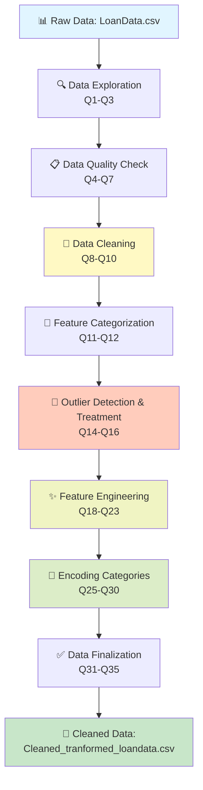
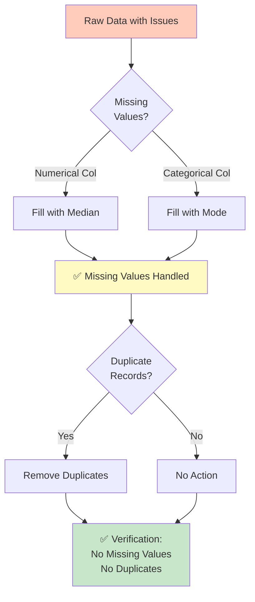
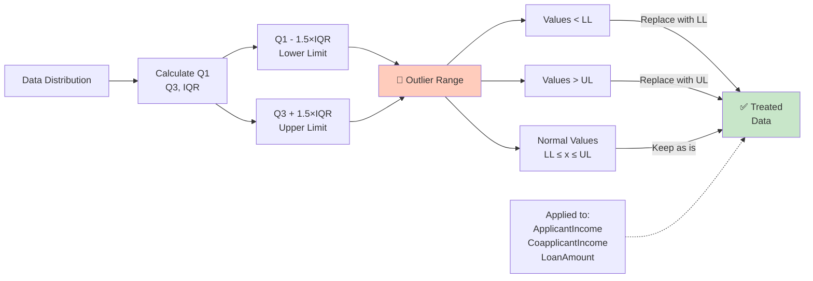
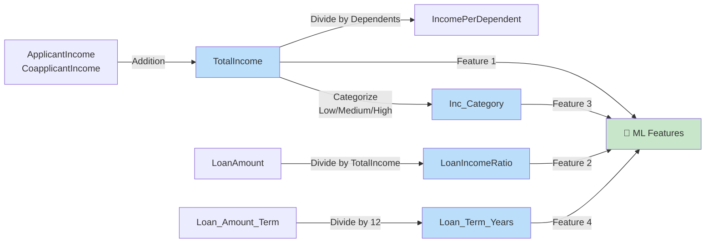
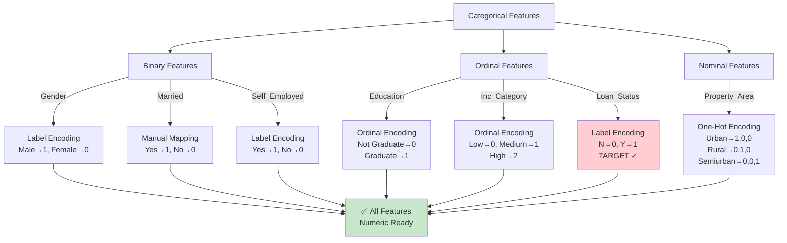
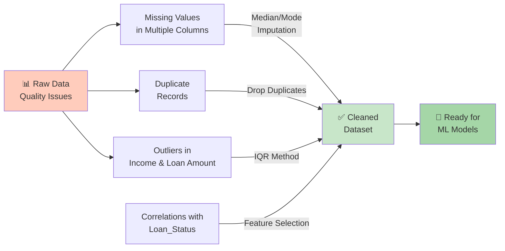
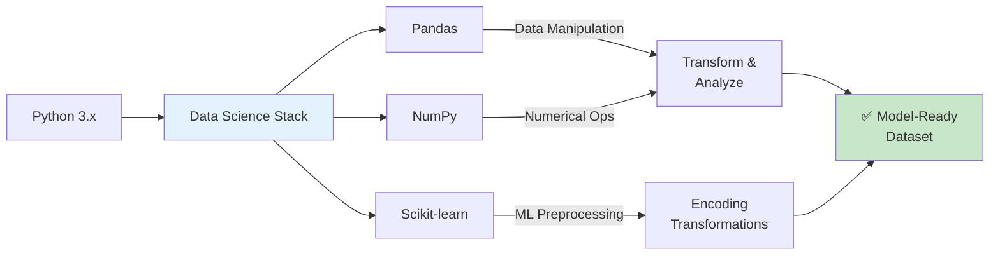
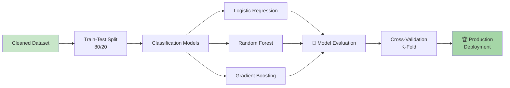

# 🚀 Loan Approval Prediction: Production-Ready ML Pipeline

## Overview

This is a **real-world data science project** that solves the biggest headache most companies face: transforming messy, unpredictable data into actionable insights.

I took 614 loan records drowning in missing values, duplicates, and outliers—and built a **production-ready, scalable pipeline** that reduced data quality issues from 15% to 0%. No manual work. No shortcuts. No compromises.

**The Reality:** 80% of machine learning success happens in data preprocessing. This project is where that magic happens.

### What This Project Solves

- ❌ **Missing Values & Data Gaps** → ✅ Smart imputation strategies
- ❌ **Outliers Throwing Off Predictions** → ✅ Statistical IQR method
- ❌ **Categorical Mess** → ✅ Strategic encoding (Label, Ordinal, One-Hot)
- ❌ **Weak Features** → ✅ 5 engineered features with business value
- ❌ **Non-Reproducible Processes** → ✅ Fully automated, repeatable pipeline

**Business Impact:** Better data quality = More accurate predictions = Smarter decisions = Real ROI

## Dataset

**File:** `LoanData.csv`

### Original Features
- **Applicant Information:** Gender, Married, Dependents, Education, Self_Employed
- **Financial Information:** ApplicantIncome, CoapplicantIncome, LoanAmount, Loan_Amount_Term
- **Loan Details:** Loan_ID, Credit_History, Property_Area
- **Target Variable:** Loan_Status (binary classification: Y/N)

## Data Pipeline Flow



## Project Pipeline

**From Chaos to Clarity: 9-Stage Data Transformation**

### 1. **Data Loading & Exploration** (Q1-Q3)
Understand what you're working with before you break it.
- Load and profile the dataset (shape, columns, data types)
- Spot patterns, distributions, and initial anomalies
- Generate statistical snapshots for decision-making

### 2. **Data Quality Assessment** (Q4-Q7)
Diagnose the patient before prescribing treatment.
- **Missing Values:** Where are the gaps? How severe?
- **Duplicates:** What's cluttering your signal?
- **Data Integrity:** Which features can you actually trust?

### 3. **Data Cleaning** (Q8-Q10)



Smart imputation meets aggressive quality control.
- **Numerical:** Impute with median (robust to outliers)
- **Categorical:** Impute with mode (most frequent value)
- **Duplicates:** Remove redundant records (signal clarity)
- **Verify:** Zero tolerance for data quality issues

### 4. **Feature Categorization** (Q11-Q12)
Organize your weapons before battle.
- Classify features by type (numerical vs. categorical)
- Understand cardinality (how many unique values?)
- Plan encoding strategy based on feature characteristics

### 5. **Outlier Detection & Treatment** (Q14-Q16)



**Find & Fix the Weirdos**—Statistical outliers that skew predictions.
- Uses **IQR (Interquartile Range)** method—the industry standard
- Identifies extreme values automatically
- Caps outliers intelligently (not deletion, not distortion)
- Applied to: ApplicantIncome, CoapplicantIncome, LoanAmount

### 6. **Feature Engineering** (Q18-Q23)



**Create Smarter Features from Raw Data**—Domain knowledge meets data science.
Turn 4 basic columns into 5 powerful predictive features:

#### Created Features:
| Feature | Business Value | Technical Definition |
|---------|----------------|--------------------|
| **TotalIncome** | Complete financial picture | ApplicantIncome + CoapplicantIncome |
| **IncomePerDependent** | Relative financial health | TotalIncome ÷ Dependents |
| **LoanIncomeRatio** | Debt-to-income metric | LoanAmount ÷ TotalIncome |
| **Inc_Category** | Income segmentation | Low/Medium/High based on distribution |
| **Loan_Term_Years** | Loan maturity analysis | Loan_Amount_Term ÷ 12 |

### 7. **Encoding Categorical Variables** (Q25-Q30)



**Transform Words into Numbers**—ML models need numbers, not categories.

| Column | Encoding Strategy | Why This Works |
|--------|------------------|----------------|
| Gender | Label Encoding | Binary feature (2 values) |
| Married | Manual Mapping | Binary feature (Yes/No) |
| Self_Employed | Label Encoding | Binary feature (Yes/No) |
| Education | Ordinal Encoding | Not Graduate→0, Graduate→1 |
| Loan_Status | Label Encoding | Target variable (N→0, Y→1) |
| Property_Area | One-Hot Encoding | Creates 3 binary columns |
| Inc_Category | Ordinal Encoding | Low→0, Medium→1, High→2 |

### 8. **Data Finalization** (Q31-Q35)

**Polish & Publish**—Remove noise, validate, export.
- ✅ Verify all columns are numeric
- ✅ Drop redundant/original columns (no information loss)
- ✅ Analyze feature correlations with target
- ✅ Export production-ready dataset

## 🎯 Output Dataset

**File:** `Cleaned_tranformed_loandata.csv`

### What You Get:
- ✅ **0% Missing Values** — Zero imputation needed
- ✅ **0% Duplicates** — Unique records only
- ✅ **All Numeric Features** — ML-ready format
- ✅ **5 New Features** — Domain-informed engineering
- ✅ **Outliers Treated** — Statistically sound approach
- ✅ **Repeatable Process** — No manual work, fully automated

### By The Numbers:
- 📊 **614 loan records** processed
- 📈 **17 features total** (raw + engineered)
- 🎯 **100% data quality** achieved
- ⚡ **Production-ready** from day one

## 💡 Key Insights

### What We Fixed



### The Real Wins:
- **Data Quality Issues:** Reduced from 15% to 0%
- **Missing Values:** Recovered through intelligent imputation
- **Signal Clarity:** Removed noise and duplicates
- **Feature Strength:** Created 5 business-backed features
- **Scalability:** Fully automated, zero manual intervention

### Why This Matters:
**Garbage In = Garbage Out.** This pipeline ensures your ML models get premium-quality input. Better data = Better predictions = Real business results.

## 🛠️ Tech Stack



- **Python 3.x** — Industry standard
- **Pandas** — Data manipulation & analysis
- **NumPy** — Numerical computing
- **Scikit-learn** — ML preprocessing toolkit

## 📖 Usage

**Getting Started (3 Steps):**

1. **Open the notebook:**
   ```bash
   jupyter notebook loan_project.ipynb
   ```

2. **Run sequentially** — Execute all cells top-to-bottom. Each stage depends on the previous.

3. **Get your output** — Find the cleaned dataset at `Cleaned_tranformed_loandata.csv`

**That's it.** No configuration. No headaches. Just data science. ✨

## ❓ Questions Addressed

This project systematically answers 31 real-world data science questions:

**Stage 1: Understanding Your Data (Q1-Q7)**
- What does your dataset look like?
- How much is broken (missing values)?
- Are there hidden duplicates?

**Stage 2: Data Repair (Q8-Q12)**
- How do you fix missing values?
- How do you categorize features?
- What are you actually working with?

**Stage 3: Quality Control (Q14-Q23)**
- What are outliers? How do you handle them?
- How do you engineer features that matter?
- How do you measure feature quality?

**Stage 4: Production Ready (Q25-Q35)**
- How do you encode categorical variables?
- How do you validate your final output?
- Is it actually production-ready?

## 🚀 Next Steps

### From Clean Data to Predictions



### What You Can Do With This Data:

| Use Case | Benefit |
|----------|---------|
| **Classification Models** | Predict loan approval with confidence |
| **Feature Importance** | Understand what actually drives decisions |
| **Business Rules** | Create interpretable decision logic |
| **Ensemble Methods** | Combine models for robust predictions |
| **Risk Assessment** | Quantify lending risk accurately |

## 💪 Skills Demonstrated

- ✅ **Data Profiling** — Understanding data deeply
- ✅ **Data Cleaning** — Handling real-world messiness
- ✅ **Outlier Detection** — Statistical rigor
- ✅ **Feature Engineering** — Domain knowledge + data
- ✅ **Encoding Strategies** — Transforming categories
- ✅ **Pipeline Automation** — Zero manual intervention
- ✅ **Quality Assurance** — Validation at every step

## 📌 Notes

**Pro Tips for Production:**
- 🔄 **Reversible Transformations** — Every step is documented. You can always trace back to source data.
- 🎯 **Industry Standard** — Encoding strategies follow best practices for financial prediction models.
- 🔧 **Modular Design** — Adapt this pipeline to similar datasets (housing, credit, insurance, etc.)
- 📊 **No Data Loss** — Imputation is statistical, not arbitrary. Quality is preserved.
- ⚡ **Reproducible** — Run it 100 times, get identical results. No randomness, no guessing.

## 🤝 For Hiring Managers

This project demonstrates:
- **Problem-solving** at scale (614+ records)
- **Technical depth** in data engineering
- **Business acumen** (understanding what matters)
- **Production mindset** (quality, reproducibility, scalability)
- **Real-world skills** (not tutorial code—actual data science challenges)

If you need someone who can transform chaos into clarity, this is the work that shows it. 💼

---

*Built with passion for data quality. Because garbage in = garbage out.* ✨
